# wfcast

Someplace weather forecast Django example

[](https://github.com/cookiecutter/cookiecutter-django/)
[](https://github.com/astral-sh/ruff)

License: MIT

## Прогноз погоды.

Пользователь вводит название города, используя автодополнение.
После подтверждения выбора перенаправляется на страницу с результатами:
- текущее состояние
- почасовой прогноз
- недельный прогноз


[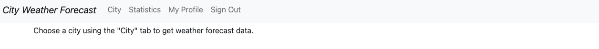]()

[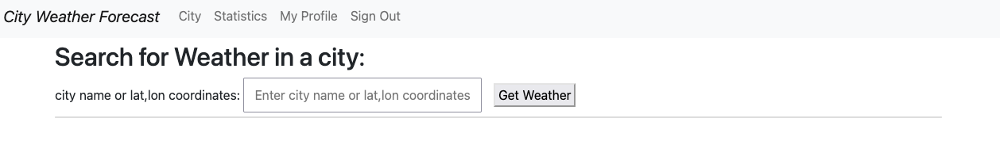]()

[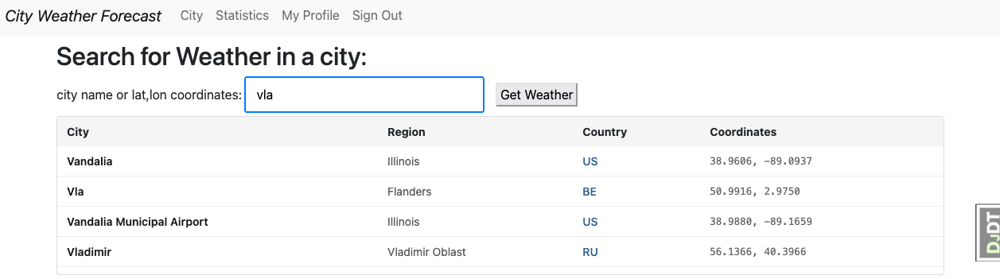]()

[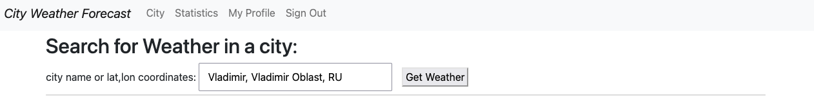]()

[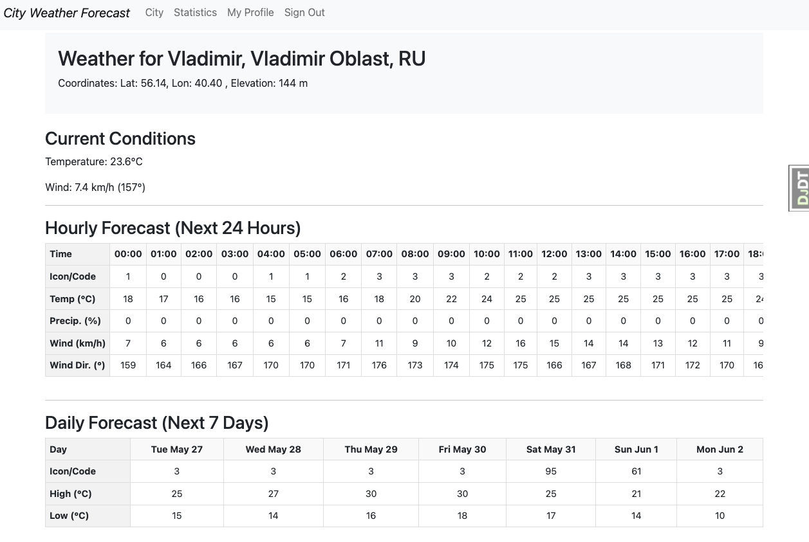]()

[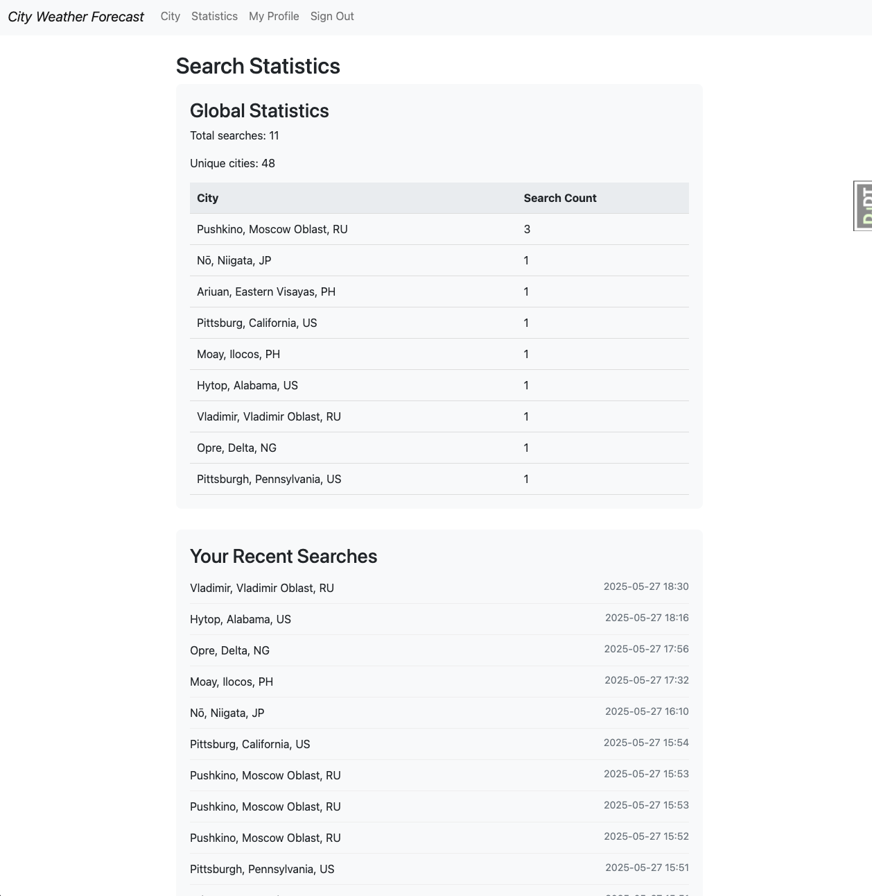]()

Выделена страница статистики доступ к кторой разрешен авторизованным пользователям.
Авторизация пользователя по email.

[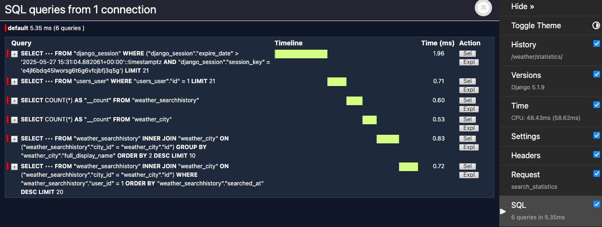]()

Использованы:
- Cookiecutter Django для быстрой настройки.
- Ruff
- djlint
- Safety (CI)
- Gitleaks (CI)
- HTMX для автодополнений (см. *templates/weather/city_search.html*)
- Docker Compose

## Запуск

Образ на DockerHub не размещал, поэтому скопировать репозиторий

```bash
gh repo clone valed-dm/wfcast
git switch dev

docker-compose -f docker-compose.local.yml build
docker-compose -f docker-compose.local.yml up -d
```
[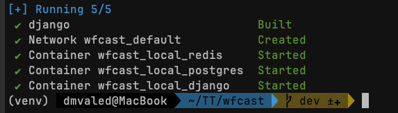]()

[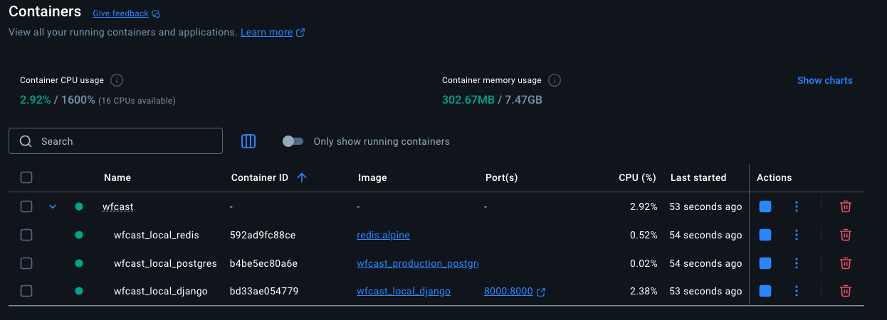]()

[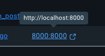]()

[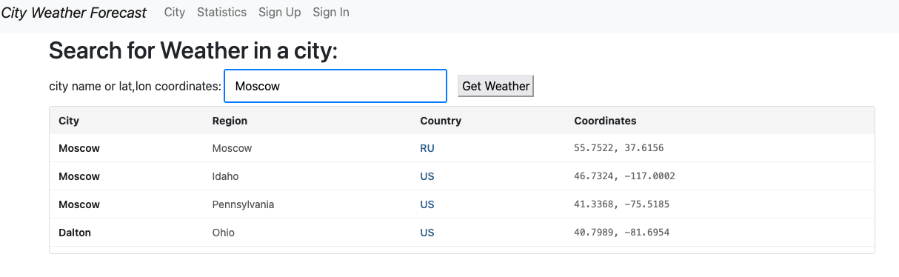]()

[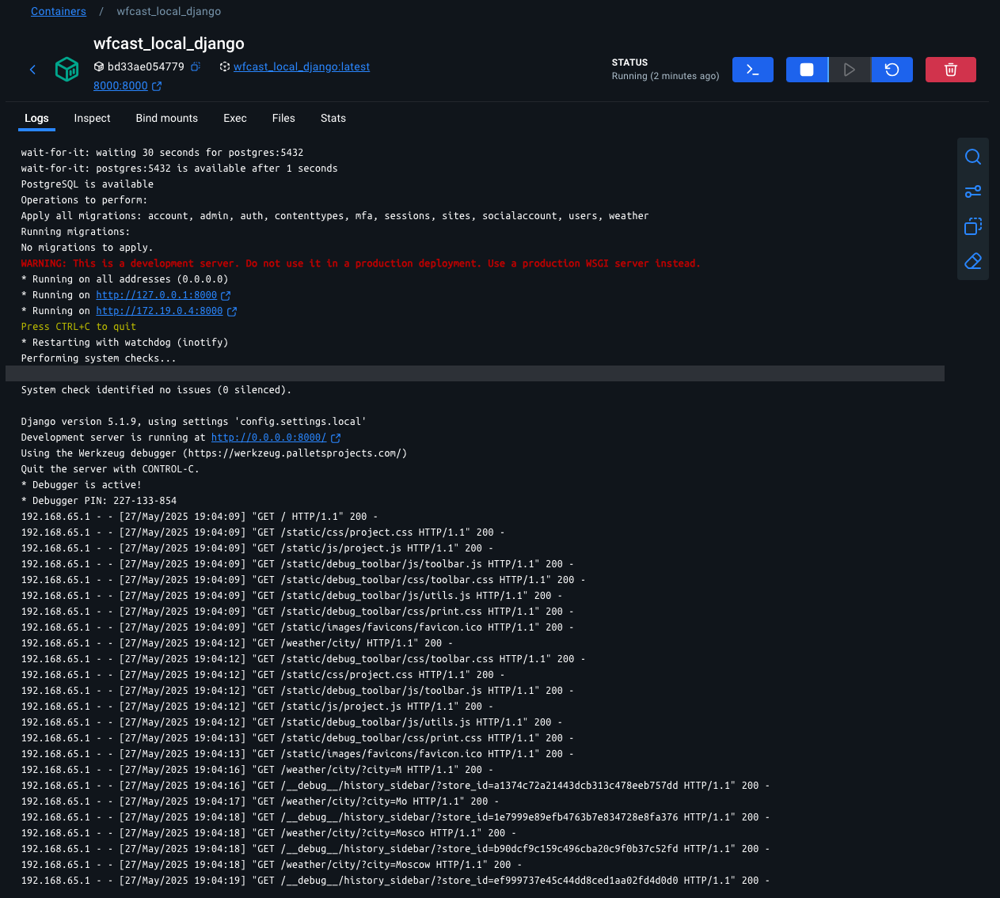]()


### Не сделано:
 - повторное посещение
 - REST для статистики

Причина: неопределенный дедлайн, пора сдавать.
Все это и гораздо больше реализовано в представленных проектах в этом репозитории.
Спасибо за задание.

## Settings

Moved to [settings](https://cookiecutter-django.readthedocs.io/en/latest/1-getting-started/settings.html).

## Basic Commands

### Setting Up Your Users

- To create a **normal user account**, just go to Sign Up and fill out the form. Once you submit it, you'll see a "Verify Your E-mail Address" page. Go to your console to see a simulated email verification message. Copy the link into your browser. Now the user's email should be verified and ready to go.

- To create a **superuser account**, use this command:

      $ python manage.py createsuperuser

For convenience, you can keep your normal user logged in on Chrome and your superuser logged in on Firefox (or similar), so that you can see how the site behaves for both kinds of users.

### Type checks

Running type checks with mypy:

    $ mypy wfcast

### Test coverage

To run the tests, check your test coverage, and generate an HTML coverage report:

    $ coverage run -m pytest
    $ coverage html
    $ open htmlcov/index.html

#### Running tests with pytest

    $ pytest

### Live reloading and Sass CSS compilation

Moved to [Live reloading and SASS compilation](https://cookiecutter-django.readthedocs.io/en/latest/2-local-development/developing-locally.html#using-webpack-or-gulp).

## Deployment

The following details how to deploy this application.

### Docker

See detailed [cookiecutter-django Docker documentation](https://cookiecutter-django.readthedocs.io/en/latest/3-deployment/deployment-with-docker.html).
